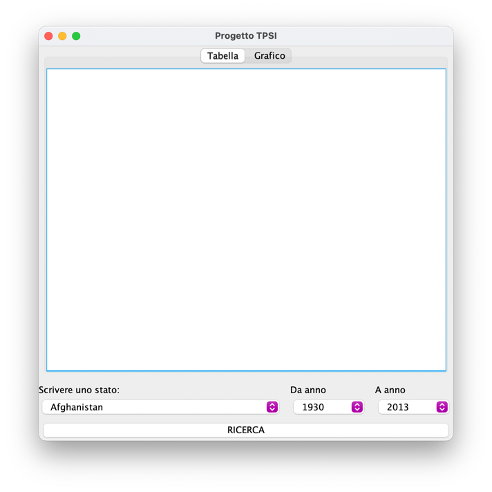
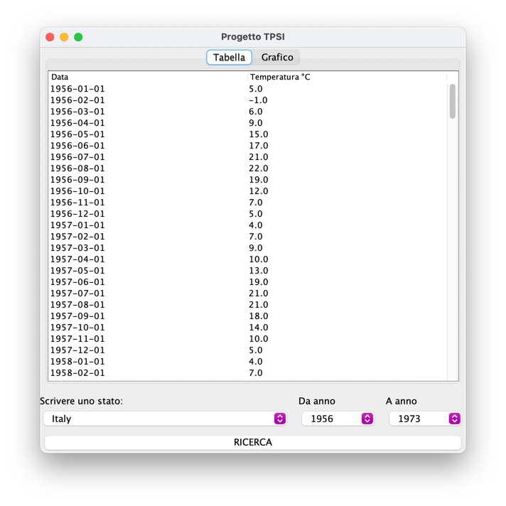
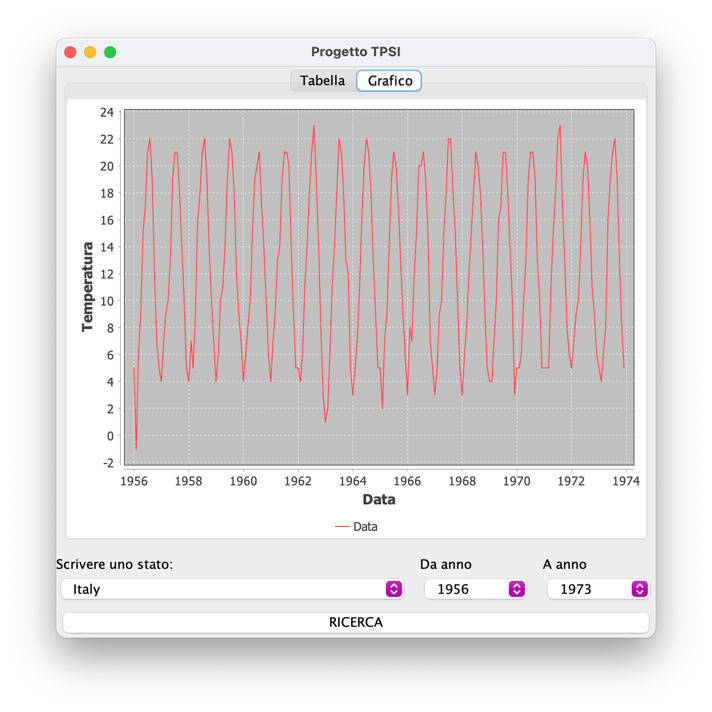
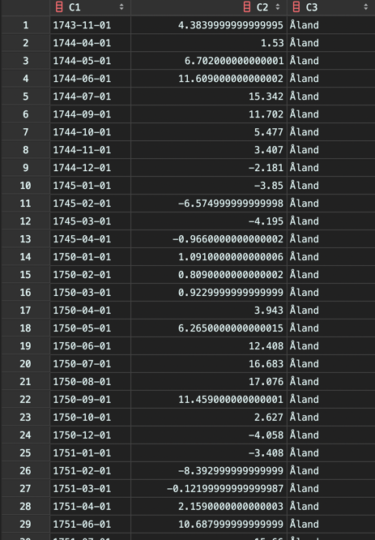

## Progetto TPSI - Temperatura nel corso degli anni
#### Gruppo Fumagalli - Liddi - Martinelli

### Introduzione
Appena aperta l'applicazione si presenta con un'interfaccia grafica composta
da due finestre (Tabella e Grafico) e da dei menu a tendina che permettono la
selezione di Stato e fascia di anni di cui si vuole sapere la temperatura.

Se si clicca sul tasto 'RICERCA' comparirà una tabella in cui sono specificate 
data e temperatura.

Oltre alla tabella, si può visualizzare anche un grafico.

### Dataset
Il dataset che abbiamo preso è __[questo](https://www.kaggle.com/datasets/berkeleyearth/climate-change-earth-surface-temperature-data)__.
Abbiamo tolto alcune informazioni superflue per il nostro progetto ed il dataset 
risultante è il seguente:

### Strumenti
* IntelliJ Idea
* kaggle.com (per recuperare il dataset)
* github.com (per condividere il progetto tra i partecipanti)
